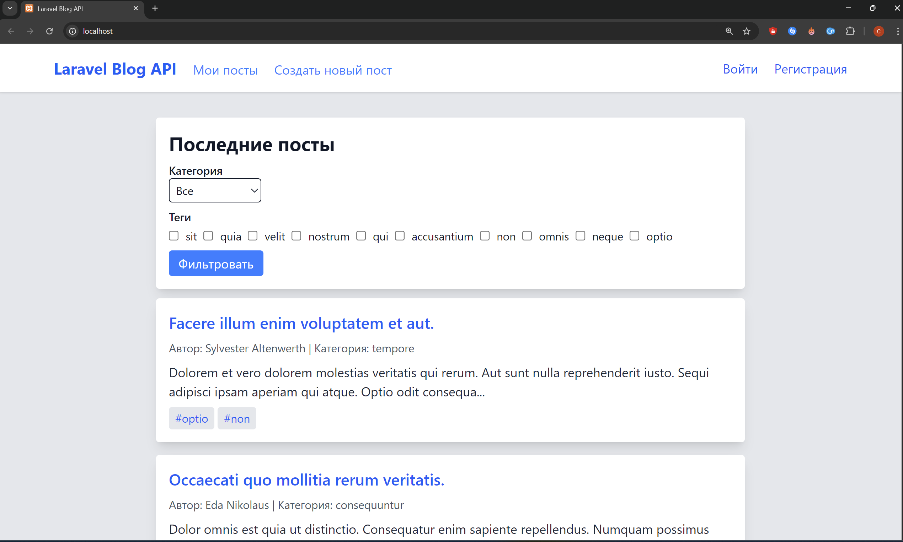
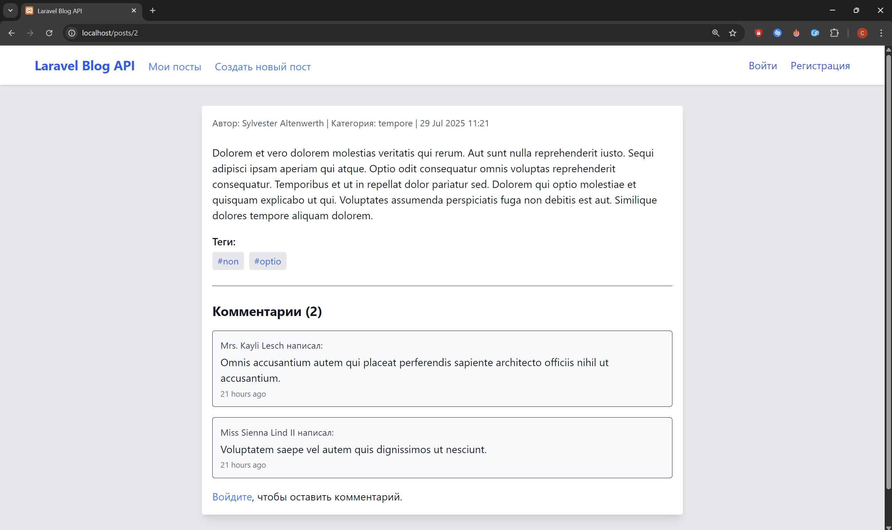
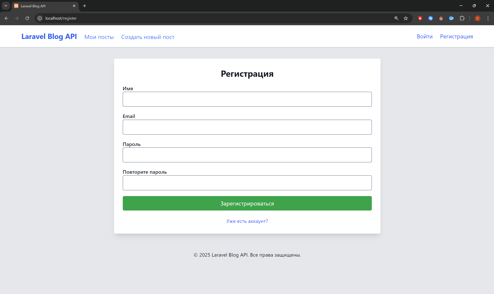
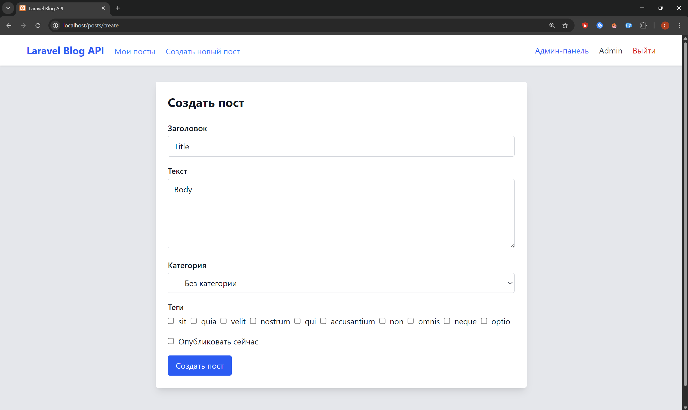
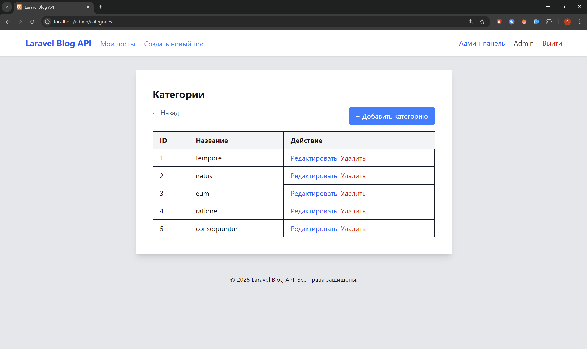
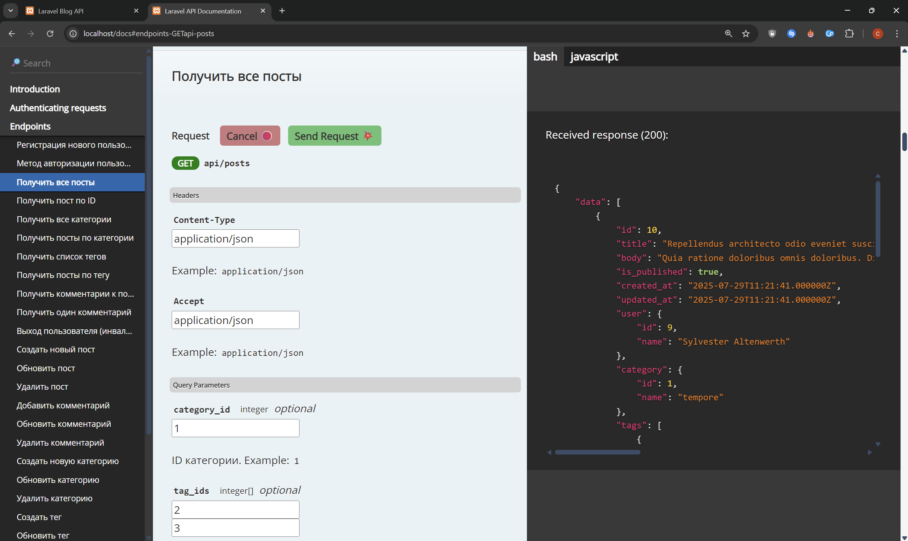

# Laravel Blog API


Проект представляет собой REST API для блога, написанный на Laravel с использованием Laravel Sanctum, PostgreSQL, Docker и модульной архитектуры. API позволяет создавать, редактировать и просматривать посты, комментарии, категории и теги с разграничением прав доступа. Приложение включает также Blade-интерфейс с адаптивной версткой и минималистичным UI.

---

## Функциональность

- Регистрация и авторизация пользователей (Laravel Sanctum)
- Создание, редактирование и удаление постов
- Комментарии к постам
- Категории и теги для постов
- Разграничение прав доступа (гость, пользователь, администратор)
- Пагинация и фильтрация постов (по категориям и тегам)
- Blade-интерфейс: главная страница, просмотр постов, форма авторизации/регистрации
- Полноценное API покрытие
- Документация API через [Scribe](https://scribe.knuckles.wtf)
- Юнит и функциональные тесты
- Docker-окружение (Laravel Sail)

---

## Быстрый старт

1. Установите зависимости и поднимите проект (см. раздел "Установка")
2. Перейдите в браузере на [`http://localhost`](http://localhost)
3. Авторизуйтесь как `admin@example.com` / `12345`
4. Используйте интерфейс или перейдите в `/docs` для тестирования API


## Скриншоты интерфейса

- Главная страница (список постов, фильтрация по категориям и тегам)

- Просмотр поста с комментариями

- Форма входа и регистрации

- Создание/редактирование поста (если авторизован)

- Админ-панель для редактирования категорий или тегов

---

## Стек технологий

- PHP 8.3+
- Laravel 12
- PostgreSQL
- Laravel Sanctum
- Laravel Sail (Docker)
- Blade + TailwindCSS
- PHPUnit
- Scribe (документация API)
- Eloquent ORM, Policies, Factories, Seeders
---

## Установка

### Вариант 1: Установка через Docker (рекомендуется)

> Не требуется локальный PHP или Composer — только установленный Docker.

```bash
# Клонируем репозиторий
git clone https://github.com/IlnurSK/laravel-blog-api.git
cd laravel-blog-api

# Устанавливаем зависимости через официальный образ Laravel Sail
docker run --rm \
  -u "$(id -u):$(id -g)" \
  -v $(pwd):/var/www/html \
  -w /var/www/html \
  laravelsail/php83-composer:latest \
  composer install

# Копируем файл окружения и генерируем ключ приложения
cp .env.example .env

# Поднимаем контейнеры
./vendor/bin/sail up -d

# Генерируем ключ и запускаем миграции с сидерами
./vendor/bin/sail artisan key:generate
./vendor/bin/sail artisan migrate --seed

# Vite и TailwindCSS (Frontend Blade)
Для корректной работы Blade-интерфейса со стилями, необходимо запустить Vite:

# Подключитесь к контейнеру Laravel
./vendor/bin/sail shell

# Установите npm-зависимости (если не установлены)
npm install

# Запустите Vite в режиме разработки
npm run dev

# Перейдите в браузере на `http://localhost`
```

### Вариант 2: Установка через локальный PHP и Composer

> Если у вас установлен PHP 8.3+ и Composer, вы можете выполнить установку вручную.

```bash
# Клонируем репозиторий
git clone https://github.com/IlnurSK/laravel-blog-api.git
cd laravel-blog-api

# Устанавливаем зависимости
composer install

# Копируем файл окружения
cp .env.example .env

# Поднимаем контейнеры Laravel Sail
./vendor/bin/sail up -d

# Генерируем ключ и запускаем миграции с сидерами
./vendor/bin/sail artisan key:generate
./vendor/bin/sail artisan migrate --seed

# Vite и TailwindCSS (Frontend Blade)
Для корректной работы Blade-интерфейса со стилями, необходимо запустить Vite:

# Подключитесь к контейнеру Laravel
./vendor/bin/sail shell

# Установите npm-зависимости (если не установлены)
npm install

# Запустите Vite в режиме разработки
npm run dev

> ⚠️ Не закрывайте этот терминал, пока работает Vite. При остановке Vite стили перестанут отображаться.

# Перейдите в браузере на `http://localhost`
```
---

## Запуск тестов

```bash
./vendor/bin/sail test
```

---

## Роли и права доступа

| Роль         | Возможности                                                       |
| ------------ |-------------------------------------------------------------------|
| Гость        | Просмотр постов и комментариев                                    |
| Пользователь | Создание, редактирование и удаление **своих** постов/комментариев |
| Админ        | Полный доступ ко всем сущностям, включая категории и теги         |


---

## Демо-доступ администратора

Для демонстрации прав администратора вы можете использовать готового пользователя:

- **Email:** `admin@example.com`
- **Пароль:** `12345`

Этот пользователь имеет полный доступ ко всем сущностям через веб-интерфейс и API.


## Структура API (кратко)

| Метод  | Endpoint                   | Описание                   |
| ------ | -------------------------- | -------------------------- |
| GET    | `/api/posts`               | Получить список постов     |
| POST   | `/api/posts`               | Создать пост               |
| PUT    | `/api/posts/{id}`          | Обновить пост              |
| DELETE | `/api/posts/{id}`          | Удалить пост               |
| GET    | `/api/posts/{id}/comments` | Получить комментарии поста |
| POST   | `/api/posts/{id}/comments` | Оставить комментарий       |

---

## Документация API
- Для генерации API документации с помощью SCRIBE, запустите команду
```bash
./vendor/bin/sail artisan scribe:generate
```
- Теперь полная документация доступна по адресу: [`http://localhost/docs`](http://localhost/docs)
- Включает описание всех эндпоинтов, параметров, прав доступа и примеры запросов/ответов


## Дополнительно
- Сервисно-ориентированная архитектура (PostService, CategoryService и др.)
- Все контроллеры и модели покрыты аннотациями @covers, @phpdoc для автогенерации и IDE-подсказок
- Структура соответствует PSR-12
- Используются Policies для разграничения доступа
- Eloquent-связи, фабрики и сидеры настроены для быстрой и корректной генерации данных
- Фронтенд построен на Blade + TailwindCSS (ChatGPT)

## Автор
Проект разработан как pet-project для портфолио.
Если вы рекрутер, разработчик или тимлид — с радостью выслушаю обратную связь, обсудим архитектуру и технические детали.
